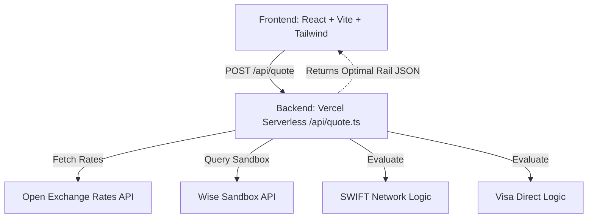

# Multirail FX Agent

A production-ready, full-stack payment routing engine that intelligently routes cross-border payments across traditional banking rails (SWIFT), Card Networks (Visa Direct), and modern Fintech APIs (Wise).

The agent fetches real-time mid-market exchange rates, parses dynamic fee structures, and recommends the optimal payout rail based on user-defined priorities (Lowest Cost, Fastest Speed, or Balanced).

## Architecture


The system uses a Single Page Application (SPA) frontend connected to a Serverless backend routing engine.



## Features

- **Dynamic Agent Execution Feed:** Real-time visibility into the agent's calculations, API requests, and decision logic.
- **Multirail Routing Logic:** Evaluates explicitly hidden FX spreads vs. flat fees.
- **Interactive Visualizations:** High-performance charting using Apache ECharts.
- **Vercel Serverless Ready:** Backend implemented as a serverless function (`/api/quote.ts`).

## Installation

1. **Clone the repository:**
   ```bash
   git clone https://github.com/your-org/multirail-fx-agent.git
   cd multirail-fx-agent
   ```

2. **Install dependencies:**
   ```bash
   npm install
   ```

3. **Configure Environment:**
   Copy `.env.example` to `.env` and add your Wise Sandbox Token (optional, will fallback to deterministic rates if not provided).
   ```bash
   cp .env.example .env
   ```

4. **Run Locally:**
   To run the frontend, simply use Vite:
   ```bash
   npm run dev
   ```
   *Note: For the `/api/quote` serverless function to work locally alongside Vite, you should use the Vercel CLI:*
   ```bash
   npm i -g vercel
   vercel dev
   ```

## Deployment Guide (Vercel)

This project is pre-configured for seamless deployment to Vercel. Vercel will automatically host the Vite frontend and map the `/api/quote.ts` file to a serverless lambda.

1. **Install Vercel CLI:**
   ```bash
   npm i -g vercel
   ```

2. **Deploy:**
   ```bash
   vercel
   ```

3. **Production Deploy:**
   ```bash
   vercel --prod
   ```

Make sure to add the `WISE_SANDBOX_TOKEN` environment variable in your Vercel project settings.

## Technology Stack

- **Frontend:** React (TypeScript), Vite, Tailwind CSS v3, Lucide React Icons
- **Data Viz:** Apache ECharts (`echarts`, `echarts-for-react`)
- **Backend:** Node.js (Vercel Serverless Functions)
